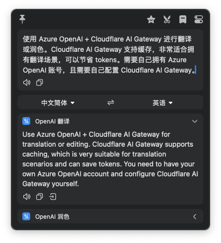

# 介绍

1. `cloudflare-translate.bobplugin`：使用 Cloudflare 托管的 Serverless 大模型进行翻译，无需任何配置，安装后即可使用。
2. `openai-translate.bobplugin`：使用 Azure OpenAI + Cloudflare AI Gateway 进行翻译或润色。Cloudflare AI Gateway 支持缓存，非常适合拥有翻译场景，可以节省 tokens。需要自己拥有 Azure OpenAI 账号，且需要自己配置 Cloudflare AI Gateway。

## 安装

1. 克隆本仓库，打开目录；
2. 双击 `.bobplugin` 文件夹即可安装完成。

